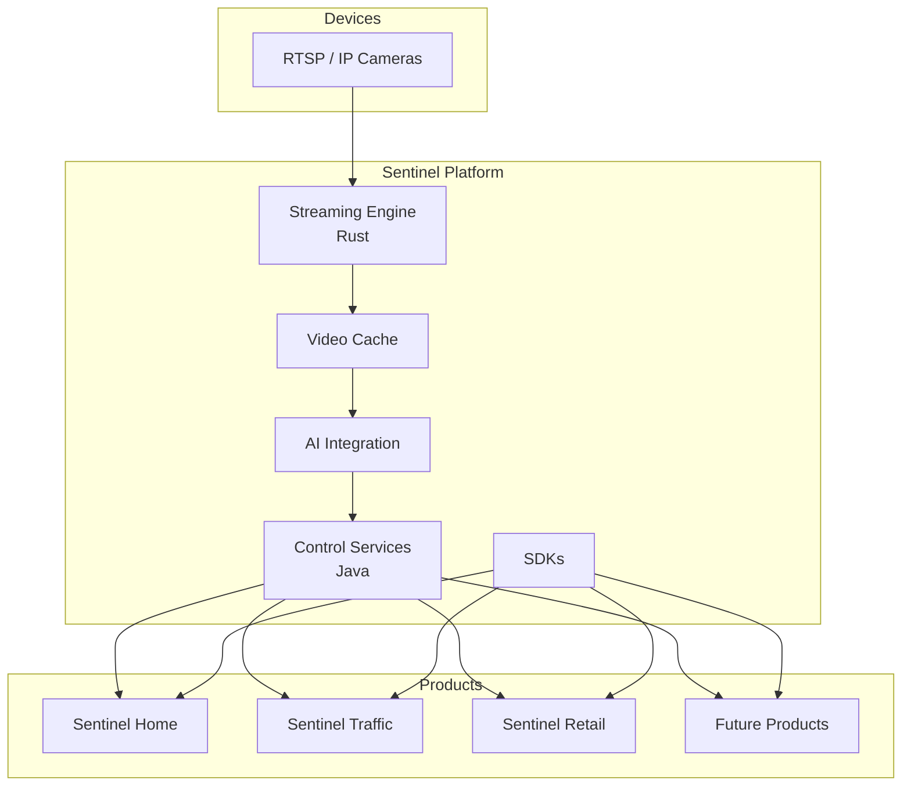
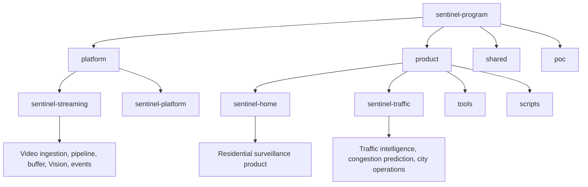

Sentinel

An AI-powered surveillance platform for building intelligent vision applications.

Sentinel is a modular platform for real-time video streaming, computer vision, AI-powered event detection, and surveillance applications.

Unlike traditional security systems, Sentinel separates the surveillance platform from the products built on top of it. This allows the same core platform to power home security, traffic monitoring, industrial safety, retail analytics, and future vision-based solutions.

⸻

Vision

Build an open, modular surveillance platform that enables developers and organizations to create intelligent vision applications without reinventing streaming, monitoring, and AI infrastructure.

⸻

Design Principles

* Platform first, products second
* High-performance streaming using Rust
* Business and orchestration services using Java
* AI model agnostic
* Edge-first architecture
* API-first design
* Modular and reusable components
* Deploy from Raspberry Pi to enterprise clusters

⸻

Architecture

## Architecture

⸻

Platform Components

Streaming

Responsible for connecting to cameras and delivering reliable real-time video.

Features:

* RTSP ingestion
* Automatic reconnect
* Multi-camera support
* Live streaming
* Frame sampling
* Stream health monitoring

⸻

Video Cache

Provides short-term rolling storage for surveillance workloads.

Features:

* Ring buffer
* Pre-event recording
* Incident clip generation
* Snapshot extraction

⸻

AI Integration

Processes video using local or cloud AI models.

Capabilities include:

* Object detection
* Person detection
* Vehicle detection
* Face recognition
* License plate recognition
* Fire and smoke detection
* Custom AI pipelines

⸻

Control Services

Provides platform management and orchestration.

Responsibilities include:

* Camera registry
* Configuration
* Health monitoring
* Incident management
* User management
* REST APIs
* WebSocket events

⸻

SDKs

Client libraries for integrating Sentinel into other applications.

Planned SDKs:

* Java
* Python
* Node.js

⸻

Products

The Sentinel Platform is designed to support multiple products.

Sentinel Home

AI-powered residential surveillance and home security.

Features:

* Live camera monitoring
* Intelligent alerts
* Home zones
* Mobile notifications
* Incident timeline

⸻

Future Products

* Sentinel Traffic
* Sentinel Retail
* Sentinel Industrial
* Sentinel Campus
* Sentinel Healthcare

⸻

Technology Stack

Layer	Technology
Streaming	Rust
Platform Services	Java / Spring Boot
Frontend	React
AI	Local and Cloud Models
Storage	PostgreSQL
APIs	REST, WebSocket

⸻

Repository Structure

Philosophy

Surveillance is the capability.

Security is one application of that capability.

Sentinel focuses on observing and understanding the physical world through intelligent video systems. Products built on Sentinel transform those observations into domain-specific actions, whether protecting a home, monitoring traffic, improving workplace safety, or enabling entirely new vision-based applications.
